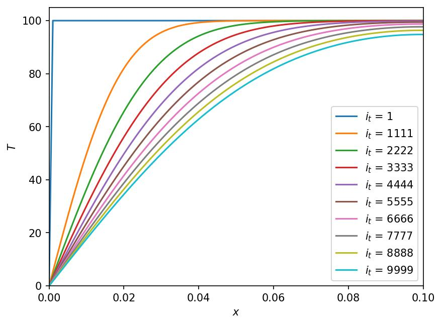

# One-dimensional simulation

The code is available in [main.ipynb](../1d/main.ipynb) notebook.

$$
    \alpha \frac{\partial^2 T(x, t)}{\partial x^2} = \frac{\partial T(x, t)}{\partial t}
$$

The equation can be expanded into

$$
    \alpha \frac{T(x+\Delta x, t) - 2 T(x, t) + T(x-\Delta x, t)}{(\Delta x)^2} = \frac{T(x, t+\Delta t) - T(x, t)}{\Delta t}.
$$

In the conventional notational used in the finite-difference methods,

$$
    T_{i_x}^{i_t+1} = T_{i_x}^{i_t} + \alpha \frac{\Delta t}{(\Delta x)^2} (T_{i_x+1}^{i_t} - 2 T_{i_x}^{i_t} + T_{i_x-1}^{i_t})
$$

## Results

