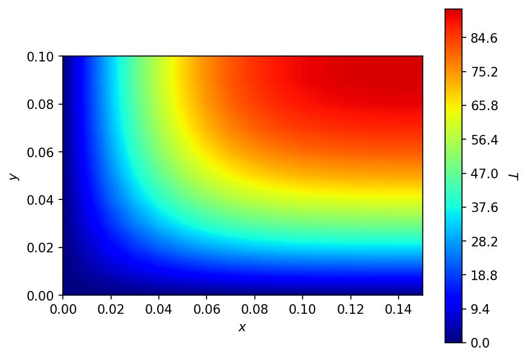
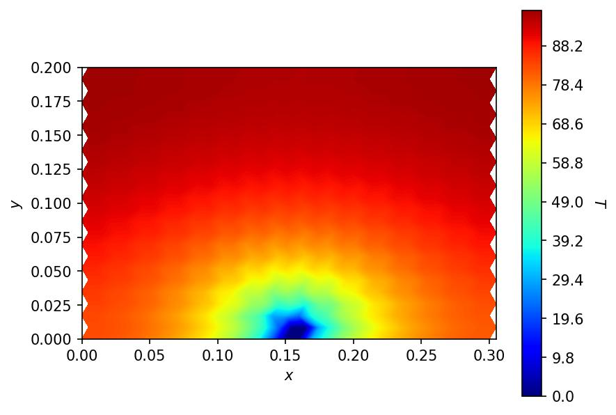

# Two-dimensional simulation

## Square lattice

The code is available in [square.ipynb](../2d/square.ipynb) notebook.

In a square lattice, heat can propagate only in two directions. (In some cases, it causes significant deviations from our expectations.)

$$
    \alpha \left( \frac{\partial^2 T(x, t)}{\partial x^2} + \frac{\partial^2 T(x, t)}{\partial y^2} \right) 
    = \frac{\partial T(x, t)}{\partial t}
$$

$$
    T_{i_x, i_y}^{i_t+1}
    = T_{i_x, i_y}^{i_t} + \alpha \Delta t \left( \frac{T_{i_x+1, i_y}^{i_t} - 2 T_{i_x, i_y}^{i_t} + T_{i_x-1, i_y}^{i_t}}{(\Delta x)^2}
    + \frac{T_{i_x, i_y+1}^{i_t} - 2 T_{i_x, i_y}^{i_t} + T_{i_x, i_y-1}^{i_t}}{(\Delta y)^2} \right)
$$

### Results

## Hexagonal lattice

The code is available in [hexagonal.ipynb](../2d/hexagonal.ipynb) notebook.

In this lattice, the number of the nearest sites is $6$, so it yields a closer simulation where we expect to see radial propagation. The distance between the neighbors is assumed to be $\Delta r$.

In this lattice, the $x$-axis is assumed to be downwards.

$$
    T_{i_x}^{i_t+1} = T_{i_x}^{i_t} + \alpha \Delta t (\nabla_1 T |_ {i_x, i_y} + \nabla_2 T |_ {i_x, i_y} + \nabla_3 T |_{i_x, i_y}),
$$

where,

$$
    \nabla_1 T |_ {i_x, i_y} = \frac{T_{i_x, i_y+1}^{i_t} - 2 T_{i_x, i_y}^{i_t} + T_{i_x, i_y-1}^{i_t}}{(\Delta r)^2}.
$$

For $i_x \in 2 n$ we have,

$$
    \nabla_2 T |_ {i_x, i_y} = \frac{T_{i_x-1, i_y}^{i_t} - 2 T_{i_x, i_y}^{i_t} + T_{i_x+1, i_y-1}^{i_t}}{(\Delta r)^2},
$$

and,

$$
    \nabla_3 T |_ {i_x, i_y} = \frac{T_{i_x+1, i_y}^{i_t} - 2 T_{i_x, i_y}^{i_t} + T_{i_x-1, i_y+1}^{i_t}}{(\Delta r)^2}.
$$

But, for $i_x \in 2 n + 1$,

$$
    \nabla_2 T |_ {i_x, i_y} = \frac{T_{i_x-1, i_y+1}^{i_t} - 2 T_{i_x, i_y}^{i_t} + T_{i_x+1, i_y}^{i_t}}{(\Delta r)^2},
$$

and,

$$
    \nabla_3 T |_ {i_x, i_y} = \frac{T_{i_x+1, i_y+1}^{i_t} - 2 T_{i_x, i_y}^{i_t} + T_{i_x-1, i_y}^{i_t}}{(\Delta r)^2}.
$$

### Results

## Boundary conditions

Boundary conditions available in this simulation can be set in two ways:
- where the system is in contact with a heat source, $T(\mathbf{r}_0, t_0) = \mathrm{cte.}$,
- and where it is free to lose/gain heat, $\nabla T |_{\mathbf{r}_0} (t) = 0$.

These are respectively implemented as follows:
- $T_{i_{x_0}, i_{y_0}}^{i_{t_0}} = \mathrm{cte.}$,
- and where $T_{i_{x_0}, i_{y_0}}^{i_{t_0}}$ is equal to one of its neighbors inside the lattice.
